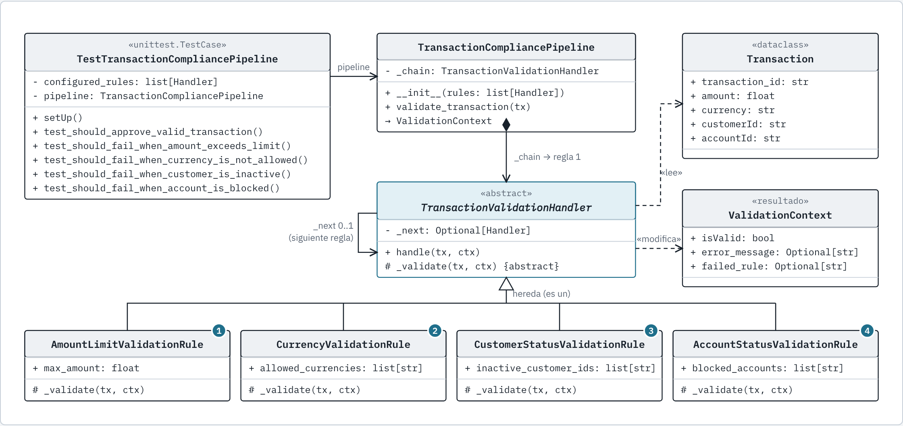
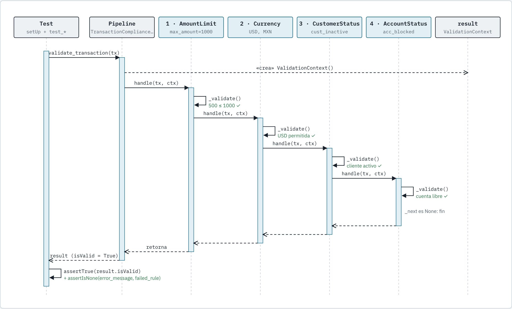

# Ejercicio 3: Evaluación de reglas de negocio

## Enunciado

Tienes la siguiente función escrita por otro desarrollador. La función decide si una operación debe aprobarse o rechazarse.

```java
public boolean shouldApprove(Transaction tx) {
    if (tx.amount > 0) {
        if (tx.currency.equals("MXN") ||
            tx.currency.equals("USD")) {
            if (tx.customerActive) {
                if (!tx.blockedAccount) {
                    if (tx.amount < 100000) {
                        return true;
                    } else {
                        if (tx.hasManagerApproval) {
                            return true;
                        }
                    }
                }
            }
        }
    }
    return false;
}
```

## Objetivo

Refactorizar la función para que sea más clara, mantenible y fácil de probar.

## Reglas de negocio

Una transacción se aprueba si:

1. El monto es mayor a 0.
2. La moneda es MXN o USD.
3. El cliente está activo.
4. La cuenta no está bloqueada.
5. Si el monto es menor a 100,000, se aprueba.
6. Si el monto es igual o mayor a 100,000, requiere aprobación del manager.

## Arquitectura Elejida: Chain of Responsibility

### Diagrama de clases



### Diagrama de secuencia (transacción válida)



### Dónde se detiene cada test (fail-fast)

| Test                                            | 1 · Monto | 2 · Moneda | 3 · Cliente      | 4 · Cuenta     | Resultado esperado             |
| ----------------------------------------------- | --------- | ---------- | ---------------- | -------------- | ------------------------------ |
| `test_should_approve_valid_transaction`         | ✅ 500    | ✅ USD     | ✅ cust_active   | ✅ acc_active  | `isValid = True`               |
| `test_should_fail_when_amount_exceeds_limit`    | ❌ 1500   | –          | –                | –              | `AmountLimitValidationRule`    |
| `test_should_fail_when_currency_is_not_allowed` | ✅ 500    | ❌ EUR     | –                | –              | `CurrencyValidationRule`       |
| `test_should_fail_when_customer_is_inactive`    | ✅ 500    | ✅ USD     | ❌ cust_inactive | –              | `CustomerStatusValidationRule` |
| `test_should_fail_when_account_is_blocked`      | ✅ 500    | ✅ MXN     | ✅ cust_active   | ❌ acc_blocked | `AccountStatusValidationRule`  |

`–` = la regla no se evalúa porque una anterior ya falló.
